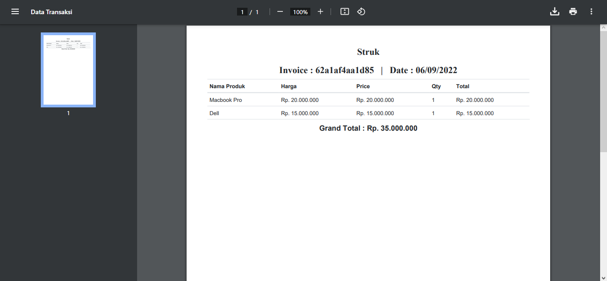

BNCC Final Project Backend Development 2022

## Daftar Isi
1. [Fitur](#fitur)
2. [Instalasi](#instalasi)
    - [Spesifikasi yang Dibutuhkan](#spesifikasi)
    - [Cara Install](#cara-install)
3. [Screenshots](#screenshots)

## Fitur

Fitur pada Aplikasi ini meliputi:

1. Akun Login
    - Register Akun
    - Login dan Logout User
2. Admin
    - Add Product
    - Delete Product
    - Update Product
    - Add Category
    - Delete Category
    - Update Category
    - Tambah barang faktur
    - Cetak Faktur
3. User
    - Tambah barang faktur
    - Cetak Faktur

User tidak bisa mengakses halaman admin page dengan memakai sistem Middleware

## Instalasi

### Spesifikasi
- PHP ^7.2
- Laravel 8.7
- Database MySQL atau MariaDB
- SQlite (untuk `automated testing`)

### Cara Install

1. Clone atau download source code
    - Para terminal, clone repo `git clone https://github.com/nipengg/FinalProjectBackend_NevilleCorneliusTjampan.git`
    - Jika tidak menggunakan Git, silakan **Download Zip** dan *extract* pada direktori web server (misal: xampp/htdocs)
    - Jika menggunakan laragon silakan extract pada direktori laragon/www
2. `cd FinalProjectBackend_NevilleCorneliusTjampan-master`
3. `composer install`
4. `cp .env.example .env`
    - Jika tidak menggunakan Git, bisa rename file `.env.example` menjadi `.env`
5. Pada terminal `php artisan key:generate`
6. Buat **database pada mysql** untuk aplikasi ini
7. **Setting database** pada file `.env`
8. `php artisan migrate --seed`
9. `php artisan serve`
10. Selesai

## Screenshots

#### Home Page

#### Manage Product Admin Page

#### Add Product Admin Page

#### Edit Product Admin Page

#### Category Product Admin Page

#### Cart Page

#### Cart Validation Page (Barang tidak akan terupdate jika stock tidak cukup)

#### Faktur dalam format PDF
